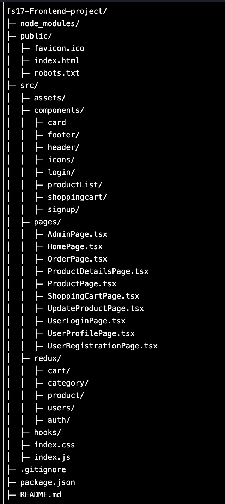

# M-Store

Welcome to M-Store, a frontend project developed with React, Typescript, Redux Toolkit, React Router Dom, and Tailwind CSS. Shoplyst aims to provide a user-friendly ecommerce experience, enabling customers to effortlessly explore various product categories like electronics, clothing, and furniture for online purchase. 

## Project Overview
M-Store is the frontend part of a Fullstack Project developed at Integrify Trainning. It seamlessly integrates with an API developed in Express.js with TypeScript, ensuring dynamic product data and efficient admin product management with proper authentication.

## Table of Contents

- [Features](#features)
- [Installation](#installation)
- [Usage](#usage)
- [Folder Structure](#folder-structure)
- [Technology Used](#contributing)
- [License](#license)

## Features

- **Product Catalog**: Browse list of products.
- **User Authentication**: Register, login, and manage your account.
- **Admin Authentication**: Add, delete and update products and categories also manage user account
- **Shopping Cart**: Add and remove products to/from the cart.
- **Checkout Process**: Create Order in DataBase.
- **Orders**: Show all Orders belongs the the login user.

## Installation

To run this project locally, follow these steps:

1. Clone this repository:

   ```bash
         git clone https://github.com/ganesh-poudel/M-Store-Ecommerce-Frontend.git

   ```

2. Navigate into the project directory:

   ```bash
         cd fs17-Frontend-project
   ```

3. Install dependencies:

   ```bash
       npm install
   ```


## Usage

4. After completing the installation steps, you can start the development server:

      ```bash
         npm start
      ```
The application will be running at http://localhost:3000 by default.


### Folder Structure
   


- Use Context API to switch theme
- Use pagination when fetching/displaying all the products
- Implement performance optimization where applicable

### Technology Used:

- TypeScript
- Redux Toolkit
- Formik
- Tailwind CSS
- DaisyUI
- React
- React Router

### Live Demo
 Check the live link here [https://steady-pasca-b7d483.netlify.app](https://steady-pasca-b7d483.netlify.app)